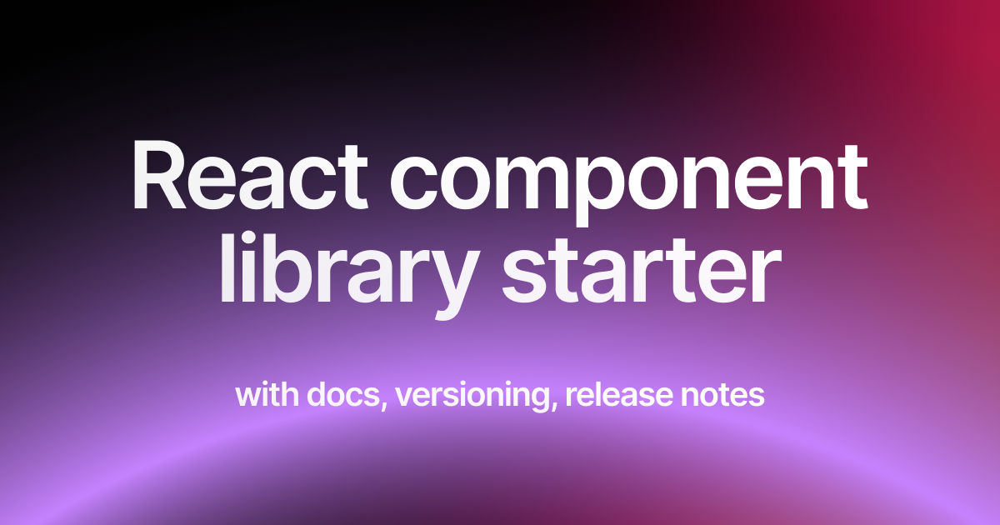

	<h1 align="center"><b>React Component Library Starter</b></h1>

    A starting point for your component library with docs, versioning, release notes
     
     
    <a href="https://midday.ai">Article on setting up from scratch</a>
    ·
    <a href="https://github.com/rjvim/react-component-library-starter/issues">Issues</a>
  

If you are going to use this repo as template, configure `apps/docs/docusaurus.config.ts` after cloning.
